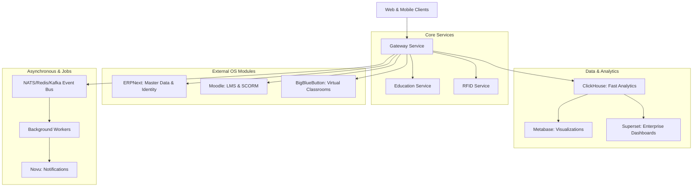

# Backend Complete Architecture Report (Volume 1)

## Overall Architecture

The platform follows a distributed, multi-tier microservices architecture tightly coupled with best-in-class open-source platforms. 

**Architecture Diagram:**

### Request Lifecycle
1. Request hits the Gateway. 
2. Gateway verifies JWT (issued primarily via ERPNext's identity).
3. If data is cached in Redis (e.g., student profile TTL 900s), Gateway returns immediately.
4. If a miss, the Gateway proxies the request to the appropriate microservice or open-source backend (Moodle, ERPNext).
5. Responses are returned, cached, and background tasks (like analytics ingestion to ClickHouse) are dispatched to Workers.

## Every Microservice Detailed Analysis

### 1. Gateway
- **Purpose**: Unified API surface for all clients.
- **Responsibilities**: Auth verification, caching, request routing, rate limiting.
- **Dependencies**: Redis, ERPNext (Identity).
- **Tech Stack**: Node.js, Express/NestJS, TypeScript.
- **Database**: None directly (Redis for cache).
- **Authentication/Authorization**: Validates JWTs, role-based access control checking against ERPNext roles.
- **Error Handling**: Standardized RFC 7807 problem details.

### 2. Workers (analytics-worker, moodle-worker, novu-worker)
- **Purpose**: Asynchronous task processing.
- **Responsibilities**: Syncing ERP data to Moodle, updating ClickHouse analytics, dispatching notification payloads to Novu.
- **Dependencies**: Redis Queue/BullMQ, NATS.
- **Tech Stack**: Node.js/TypeScript.
- **Schedulers**: Node-cron for periodic syncs.

### 3. ERPNext
- **Purpose**: System of Record (SoR) and Identity Provider.
- **Responsibilities**: Master Data Management (Students, Teachers, Batches, Fees).
- **Tech Stack**: Frappe Framework, Python, MariaDB.
- **Database**: MariaDB.
- **Background Jobs**: Frappe background scheduler (RQ).

### 4. Moodle
- **Purpose**: Learning Management.
- **Tech Stack**: PHP, PostgreSQL.

### 5. BigBlueButton
- **Purpose**: Virtual Classrooms.
- **Tech Stack**: Scala, Java, Ruby, Meteor.

### 6. Metabase & Superset
- **Purpose**: Analytics engines sitting on top of ClickHouse.

### 7. Novu
- **Purpose**: Omnichannel Notification Infrastructure.

---
[Proceed to Volume 2](./Backend_Report_Part_02.md)
