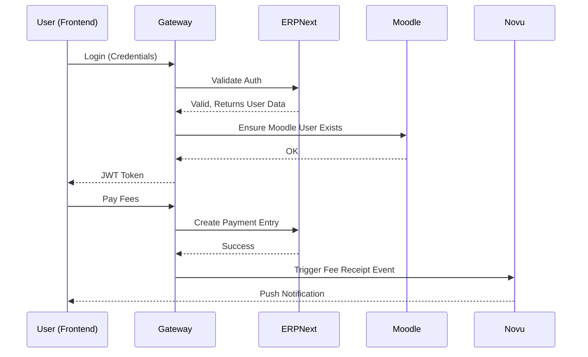

# Frontend Complete Architecture Report (Volume 2)

## Feature Analysis & Module Relationships

### 1. Learning Flow (Student Journey)
- **Workflow**: Student logs in -> Clicks "My Courses" -> Frontend fetches from Moodle (via Gateway).
- **Connected APIs**: `/api/v1/courses` (Proxies to Moodle `core_course_get_courses`).
- **UI Components**: CourseCard, ProgressRing, SCORMLauncher.

### 2. Meeting Flow (BBB Integration)
- **Workflow**: Student clicks "Join Class" -> Gateway generates BBB Join URL with checksum -> Redirects user.
- **State Updates**: React Query invalidates `live-classes` query upon meeting end event.

### 3. ERP Flow (Admin Journey)
- **Workflow**: Admin manages fees -> Submits form -> Frontend calls ERPNext `Payment Entry` API via Gateway.
- **Optimistic Updates**: UI immediately reflects "Paid" status while background worker confirms.

### 4. Notification Flow (Novu Integration)
- **Workflow**: Novu Web Component embedded in Navbar.
- **Caching**: Novu SDK manages internal caching for unread counts.

## Application Flows (Sequence)

---
[Back to Master Index](./Reverse_Engineering_Master_Index.md)
